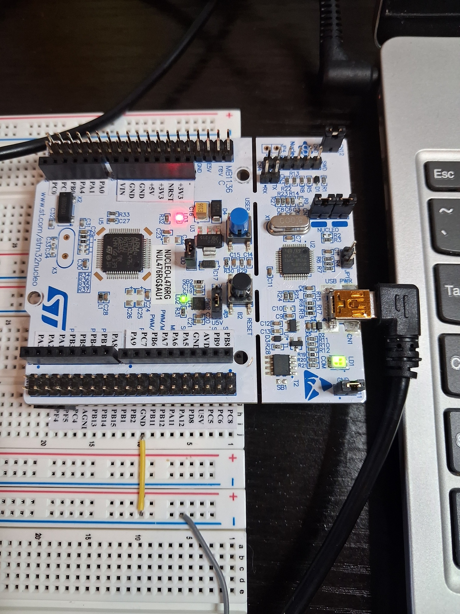

# Timer Controlled LED

## Overview

This project demonstrates the use of a timer interrupt on the STM32 NUCLEO-L476RG development board.

TIM2 is configured to generate a periodic interrupt every second. The timer interrupt service routine toggles the on-board green LED connected to PA5.

The system clock is configured to run at 80 MHz.

## Hardware

- STM32 NUCLEO-L476RG Development Board
- On-board Green LED (PA5)

## Timer Configuration

| Function | STM32 Pin |
|----------|-----------|
| Green LED | PA5 |

### TIM2 Configuration

- Timer: TIM2
- Timer interrupt enabled
- Interrupt period: 1 second
- NVIC TIM2 interrupt enabled

## Features

- Timer interrupt handling
- Periodic task execution
- 1-second LED toggle
- TIM2 configuration
- STM32 HAL-based implementation

## Project Structure

| Folder | Description |
|----------|-------------|
| Core | Application source and header files |
| Drivers | STM32 HAL and CMSIS drivers |
| Images | Hardware setup photo |

## Images

## Development Environment

- STM32CubeIDE
- STM32CubeMX
- STM32 HAL Drivers